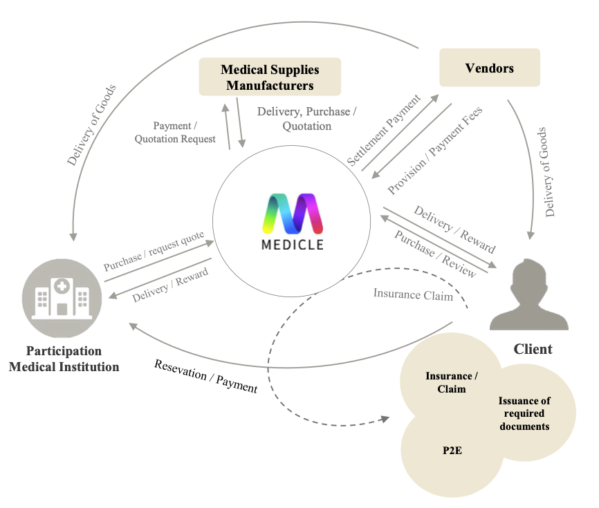

# Medicle Intro

The MEDICLE PROJECT is the world's first WEB3 healthcare ecosystem based on the Internet Computer Protocol (ICP). The MEDICLE project was started in the MyData era, which is the era of big data of personal life logs connecting medical-communication-finance to create a convenient medical service ecosystem for customer’s through the use of blockchain technology for everything including from dentistry to plastic surgery and dermatology and will be optimized in the WEB3.0 era of personalization, intelligence, and decentralization, passing through WEB1.0, where information is transmitted unilaterally, and WEB2.0, where users participate and produce information together.

### Healthcare Data Industry

The healthcare data industry is a key field in the bio healthcare industry, and there is a global consensus on the importance of the data industry. South Korea's Ministry of Health and Welfare has started developing 'Health Information Highway' and 'My Health Record App', platforms for introducing 'Medical My Data', since 2021, and is investing a lot of human and material resources. According to the '2021 Data Industry Status Survey Report' published by the Ministry of Science and ICT of Korea and the Korea Data Industry Promotion Agency, the data industry market size is expected to increase from 23.972 trillion won in 21 years to 47.1501 trillion won in 2027.

### Medical Service Industry Problem

The medical service industry is changing all the time, such as the emergence of the MyData industry, the introduction of electronic medical record systems, the globalization of the telemedicine market, and the growing medical tourism inbound, but the reality is that reasons such as fragmented EMR systems, the absence of telemedicine market systems, and the lack of reliable medical contents are acting as obstacles for growth.

### Decentralized : decentralization of medical data

Information is distributed and processed so that personal medical data in a state that cannot be forged or tampered with is transparently circulated by applying blockchain technology and it can be used for personal use such as insurance claims through aformentioned information.

### Interoperability: Interoperability of medical data

Medical data stored on the blockchain is available anytime, anywhere. Through this, it is possible to cross border barriers and embrace various customers into the ecosystem.

### Reliability: reliable medical content

We continuously supply unchanging and reliable contents that have received numerous verifications to ensure mutual satisfaction by participating in dentistry, plastic surgery, and dermatology with customers, and creating and distributing information.

## MEDICLE Platform

Starting with the first blockchain dental payment & reservation application for the MEDICLE Platform, and expand to plastic surgery and dermatology payment reservation services, and launching blockchain dental, plastic surgery, and dermatology supplies with B2B and B2C shopping malls. Furthermore, we plan to sequentially develop and operate systems of services that can swap MDI tokens with ICP and ICP-based tokens, including payment and reservation services for customers outside of Korea. Moreover, we plan to expand the ecosystem with insurance-linked solutions by utilizing blockchain technology.

